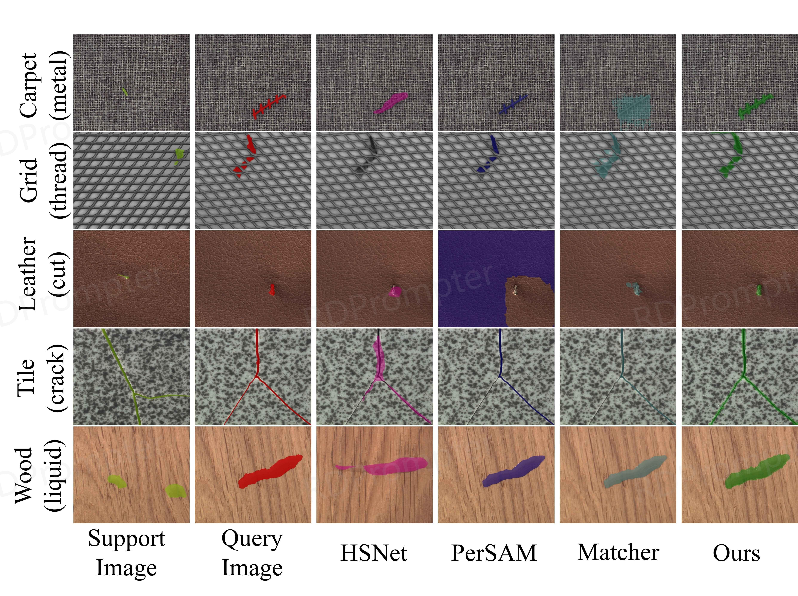
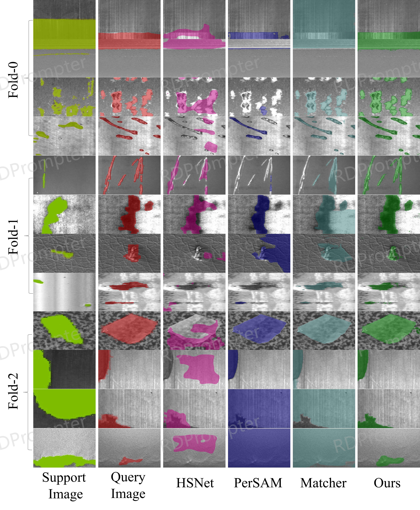
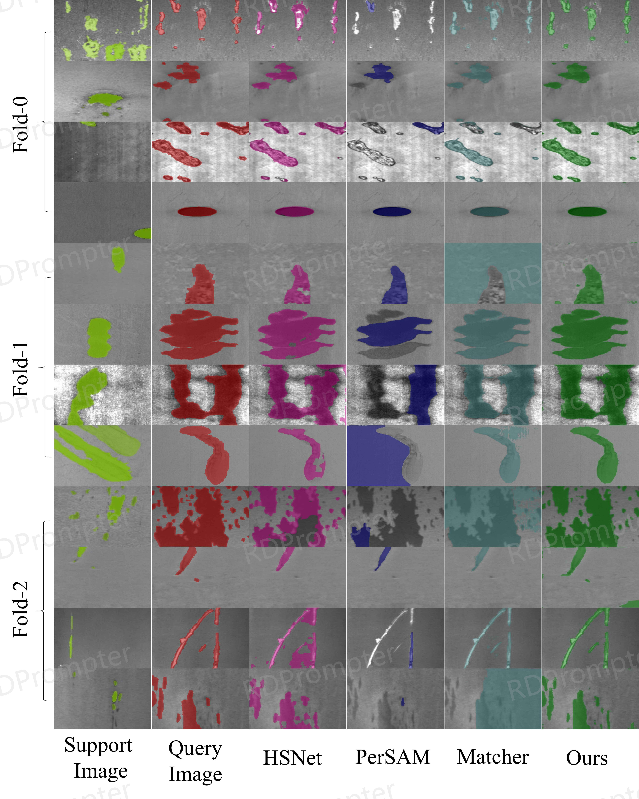
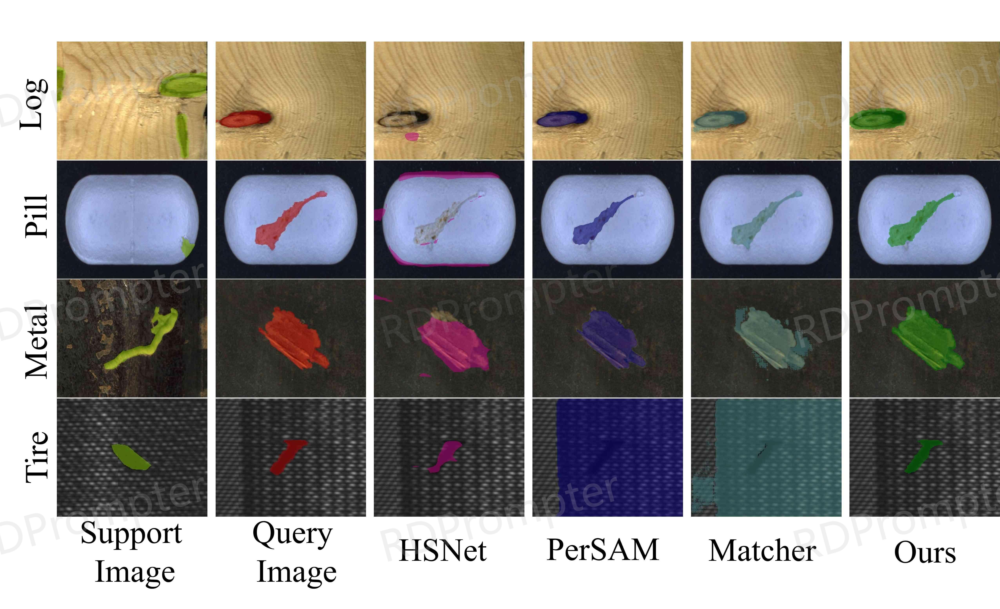

# RDPrompter（under review）

## Introduction

This repository provides the related code and  experimental details for our research on RDPrompter

## Implementation

**Environment installation**

```shell
conda create -n RDPrompter python==3.8
conda activate RDPrompter
pip install -r requirements.txt
```

**Data preparation**

+  Download MVTec AD dataset form [here](https://www.mvtec.com/company/research/datasets/mvtec-ad/downloads)，and build MVTec-Unseen dataset according to the paper "Unseen-Material Few-Shot Defect Segmentation With Optimal Bilateral Feature Transport Network"
+  Download SDD dataset form [here](https://github.com/bbbbby-99/TGRNet-Surface-Defect-Segmentation)
+  Download FSSD-12 dataset form [here](https://github.com/VDT-2048/CPANet)
+  A portion of the CID dataset is sourced from corporate collaborations. If you want to the data，please send  the email to us. we will send the download link once we receive and confirm your signed agreement. The email will be released to the public  after the review.

**Pretrained weights**

+  The  pretrained weights of SAM can be downloaded  form [here](https://github.com/facebookresearch/segment-anything)

**Parameter setting**

+ The main parameters of this project are present in the configuration files('./config/XXX.yaml').  

+ Explanation of important parameters:

    ```shell
    train:
      experiment_name: '' # The project name
      class_name: '' # The class name
    
      model:
        sam_name: 'sem_sam'   
        params:
          ckpt_path: ''   # The path of pretrained weights
          class_num: 2
          model_type: 'vit_l'   
    
      dataset:
        name: 'few_sem'
        params:
          metainfo:
            class_names: '' # The class name
          dataset_dir: '' # The path of dataset
          state: 'train'
          n_ways: 1
          n_shots: 1  # The number of samples
      
    val:
      dataset:
        name: 'few_sem'
        params:
          metainfo:
            class_names: '' # The class name
          dataset_dir: '' # The path of pretrained weights
          state: 'test'
          n_ways: 1
          n_shots: 1 # The number of samples
    、
    ```

**Training model**

* Training and validating the RDPrompter

    ```shell
    # MVTec-Unseen
    python train.py --task_name few_shot_segMVTec1
    # python train.py --task_name few_shot_segMVTec2
    # python train.py --task_name few_shot_segMVTec3
    # python train.py --task_name few_shot_segMVTec4
    # python train.py --task_name few_shot_segMVTec5
    
    # Please refer to MVTec-Unseen for running SDD,FSSD-12,CID datasets
    ```

* or just run the script

    ```shell
    sh train.sh
    ```

**Testing model**

+ Testing  the RDPrompter
    ```shell
    # MVTec-Unseen
    python test.py --task_name few_shot_segMVTec1 --model_path 'ModelPath'
    # python test.py --task_name few_shot_segMVTec2 --model_path 'ModelPath'
    # python test.py --task_name few_shot_segMVTec3 --model_path 'ModelPath'
    # python test.py --task_name few_shot_segMVTec4 --model_path 'ModelPath'
    # python test.py --task_name few_shot_segMVTec5 --model_path 'ModelPath'
    
    # Please refer to MVTec-Unseen for running SDD,FSSD-12,CID datasets
    ```

* or run the script
    ```shell
    sh test.sh
    ```

## Results

+ **MVTec-Unseen**

  

  

+ **SDD**

  

  

+ **FSSD-12**

  

+ **CID**

  

## Notes

+ The code for this project refers to [SAM](https://github.com/facebookresearch/segment-anything). Thanks for the authors for their efforts.
+ If there are any issues with the code, please  send the email  to us.
